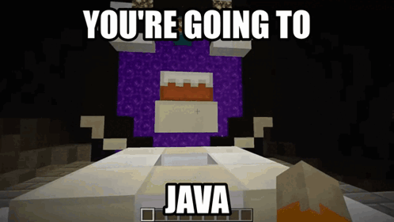

# Lenog Letter GUI v2, The successor for the Excel Dependant LetterGUI

Gah damn betul, after full consideration, meeting with Cheok, I consider to rebuild entire thing from scratch, betul ngl

Well what new, can be hosted anywere, _someone sponser me for web hosting, asal ada cara la mau hosting_ 😁, technically its can be run anywhere in the local network

Btw, still mau **Excel**, well its have the feature for export from web, smart kan gah damn dllm

## Full Fledged Web Development

I found out building using web is more convinient then using tkinter, malas sya mau buat calculate2 barang2 pelik like the width or length of windows

PDFviewing is also limited but if lets say that you still interested on tkinter version, consider to look the [Tkinker version](https://github.com/AtechPro/lenogletterv2/tree/Tkinkerver)

  
Boleh try test sini

   wkwkwkw rubuh punya tkinker, Customtkinker pun cannot help me

  

  i love Flask gah damn jatuh cinta sama dya

  

## Contribution

Sebagai seorang-seorangnya Sopware engine near, semua AI sya hantam, but i can't post here i want to become gatekeeper. Gonna become いちばんベバン 

(if you want translation lmao)
Ichiban Beban, techincally nombor 1 beban

## Continous Intergration / Continous Deployment Feature

Tbh i consider docker tapi mcm melebih2 pula jadi sya letak ja di sini the dockerfile if you really want to make an image for this system, well at least kan its can run to any computers

**Great NEWS**

If you want to try the letter generation and host it I make it public, you should make sure docker is installed on the machine before hosting

    docker pull atechpro/lenogwebui:v2.1

this is my 1st time doing proper CI/CD, just want to know how convenience/complicated I could develop. Future me would Proud like my old project  [Centralized Hub Home Automation](https://github.com/AtechPro/chha), which now are more proper CI/CD impliementation 

Despite with that its not run like proclaim run over **Over 50 Million Devices** which are JAVA

